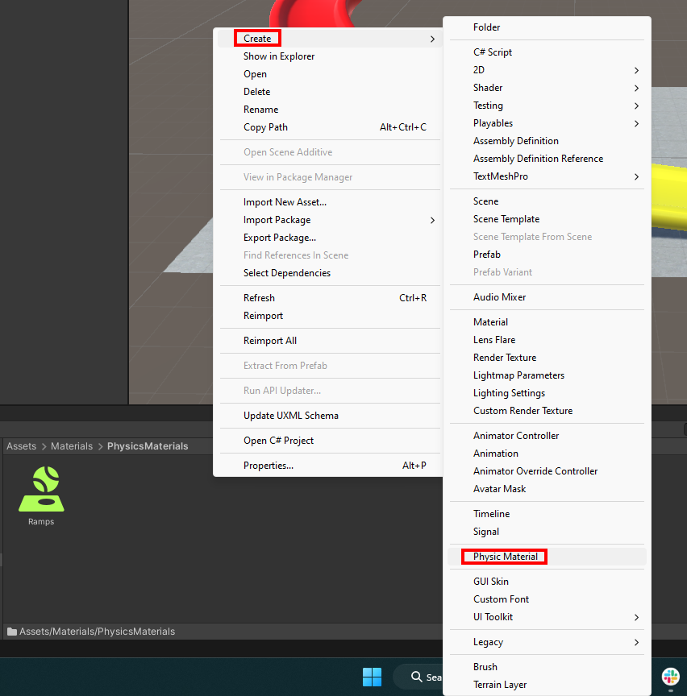
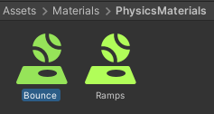

In the Project window select 'Materials' and then 'PhysicsMaterials'. Right-click in the window, click 'Create' and select **Physic Material**. 

Name the material 'Bounce'.

Change Bounciness to `1`.

Select the 'Ball' GameObject and go to the Inspector window.

Find the 'Sphere Collider' properties and click on the small circle in the 'Material' section. 

Double-click on your new 'Bounce' physics material.

